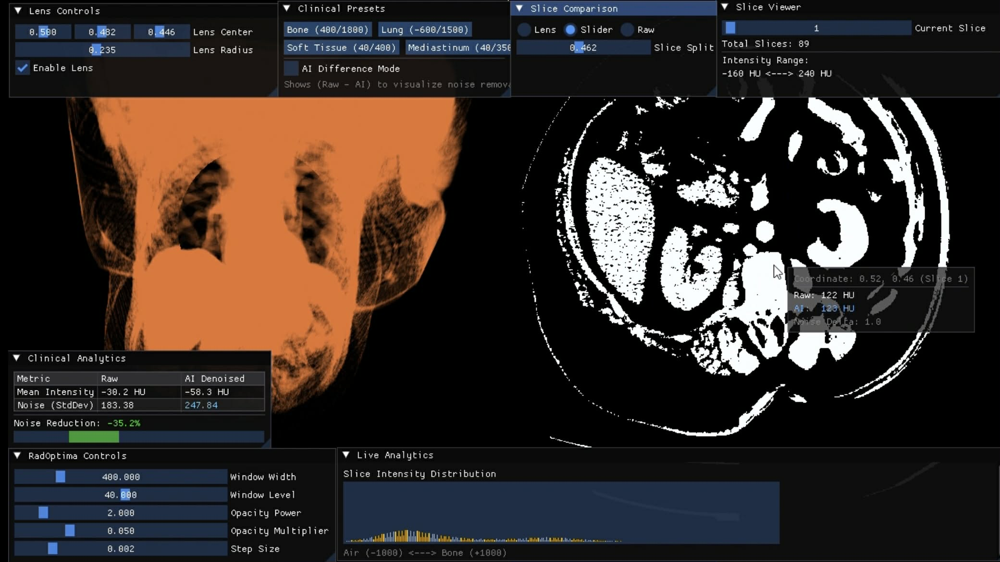

# RadOptima AI

**RadOptima AI** is a real-time medical imaging system designed to address one of the most critical challenges in modern radiology:  
> **How can we achieve high-quality diagnostic imaging while minimizing radiation exposure and preserving clinical trust?**

This project bridges **computer graphics**, **GPU systems engineering**, and **deep learning** to create an **interactive, trust-preserving CT visualization platform**.

---

## Core Problem

Modern medical imaging faces three major gaps:

- **Radiation vs. Quality Trade-off**  
  Low-dose CT scans are safer but produce **noisy, unreliable images**.

- **Real-Time Visualization Limitations**  
  High-quality 3D rendering is computationally expensive and often **not interactive**.

- **AI Trust Gap**  
  Deep learning models can **hallucinate or obscure critical details**, making clinicians hesitant to rely on them.

---

## Project Goal

RadOptima AI aims to:

> **Enable radiologists to interactively apply AI-powered denoising to low-dose CT scans in real time—without losing access to the original data.**

Instead of replacing the raw scan, the system introduces a **“human-in-the-loop” approach**, where users can:
- Compare **raw vs. AI-enhanced data**
- Focus enhancement only on regions of interest
- Maintain full control over diagnostic interpretation

---

## Key Features

### Neural Lens (Core Innovation)
A real-time **focus-aware AI system**:
- Applies denoising only where the user is looking
- Preserves raw data outside the region
- Enables **instant verification** of AI outputs

### Real-Time 3D Volume Rendering
- GPU raymarching with OpenGL
- Interactive slicing
- Transfer function editing for tissue isolation

### AI-Powered Denoising
- 3D deep learning model for low-dose CT enhancement
- Runs **on-demand inference** on sub-volumes
- Designed to minimize hallucination risks

### Dual-View Comparison
- Split-screen or lens-based visualization
- Raw vs AI-enhanced data in real time
- Supports **clinical trust and validation**

---

## System Architecture

RadOptima AI follows a **dual-stage + interactive loop architecture**:

### 1. Core Engine (C++ / CUDA)
- High-performance volume rendering
- GPU memory management
- CUDA–OpenGL interoperability (zero-copy)

### 2. AI & Application Layer (Python)
- PyTorch inference engine
- DICOM loading and preprocessing
- UI and interaction logic

### 3. Interactive Loop (Key Innovation)

Instead of:

> Input → AI → Output

The system operates as:

> User Interaction → ROI Selection → AI Inference → Instant Visual Feedback

---

This enables:
- Real-time updates  
- Reduced computation  
- Focus-aware enhancement  

---

## Technical Highlights

- **Zero-Copy GPU Pipeline**  
  Direct memory sharing between PyTorch and OpenGL using CUDA

- **Raymarching Renderer**  
  Physically-based volumetric rendering using GLSL

- **Hounsfield Unit Intelligence**  
  Native CT intensity handling for accurate tissue visualization

- **On-Demand Inference**  
  Processes only small voxel regions (e.g., 64³) for efficiency

---

## Target Users

- **Radiologists** – Faster and safer diagnostic workflows  
- **Medical Students / Residents** – Better 3D anatomical understanding  
- **Researchers / Engineers** – AI + graphics + GPU systems integration  

---

## AI Model Credit & Citation

The denoising model used in this project is based on prior research in medical imaging.

If you use or reference this system, please cite:

> E. Eulig, B. Ommer, and M. Kachelrieß,  
> *“Benchmarking deep learning-based low-dose CT image denoising algorithms,”*  
> Medical Physics, vol. 51, no. 12, pp. 8776–8788, Dec. 2024.

---

## Tech Stack

- **Languages:** Python 3.11, C++17  
- **Graphics:** OpenGL (GLSL)  
- **Compute:** CUDA 12+  
- **AI:** PyTorch, NumPy  
- **Interop:** PyBind11  

---

## Status

 **Actively in Development**  
Core systems (rendering, AI pipeline, interop) are being built and optimized.